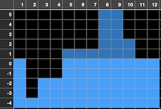

# Title: Tappy World 2
## Task ID: U006
### Main Statement
```!
See [T062 Tappy World](https://judge.hkoi.org/task/T062) but with the following modifications:

# Output
You should output the total area of the 2-D world that is above 0 (exclusive of 0).
```

### Constraint for all cases
```
- $1 ≤ M ≤ 100,000$
- $1 ≤ N ≤ 10^9$
- $1 ≤ X, Y ≤ N$
- $1 ≤ D ≤ 20,000$
```

### Samples
|Number|Input|Output|Explanation|
|---|---|---|---|
|1|<pre>9 2<br>2 3 8<br>-4 2 5</pre>|```6```|<pre> 4<br> 3<br> 2           . . .<br> 1           . . .<br> 0 .         . . . .<br>-1 .         . . . .<br>-2 .   . . . . . . .<br>-3 .   . . . . . . .<br>-4 . . . . . . . . .<br>   1 2 3 4 5 6 7 8 9</pre>|
|2|<pre>12<br>2 3 10<br>-4 2 7<br>3 5 9</pre>|```15```||

### Images


### Scoring mode
HKOI

## Judging mode
Plain text comparison

### Solution program
Language: C++11
```cpp!
#include <iostream>
#include <vector>
#include <algorithm>
using namespace std;

int N, M;
vector<pair<int, int> > D;

int main() {
    int i, d, x, y, last = 0;
    cin >> N >> M;
    for (i=0; i<M; i++) {
        cin >> d >> x >> y;
        D.push_back({x, d});
        D.push_back({y+1, -d});
    }
    D.push_back({N+1, 0});
    sort(D.begin(), D.end());
    long long h = 0, area = 0;
    for (auto p: D) {
        if (h > 0)
            area += h * (p.first - last);
        h += p.second;
        last = p.first;
    }
    cout << area << endl;
    return 0;
}
```

### Subtasks
|Number|Points|Constraints|# Tests|
|---|---|---|---|
|1|50|`$1 ≤ N ≤ 100,000$`|20|
|2|50|`No further constraints`|10|

---
